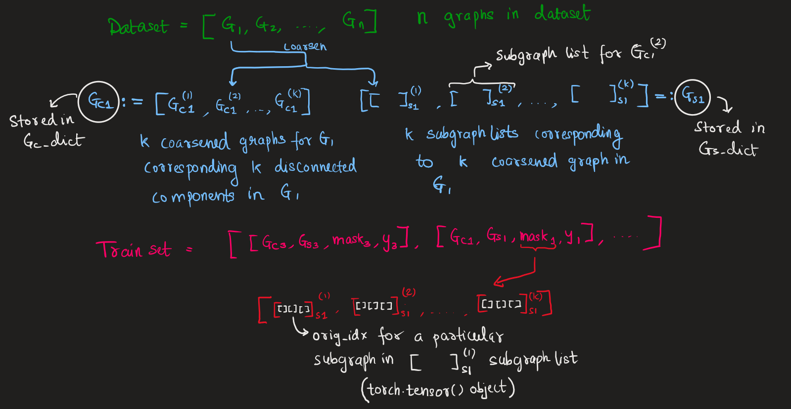

# CoPart-GNN

Dataset used for Graph Level Tasks : `ENZYMES (torch_geometric.datasets.TUDataset)`

## Description of Workflow

---

## Important files added/modified
./test.py 
./utils.py 
./temp.ipynb

